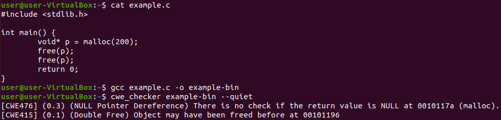
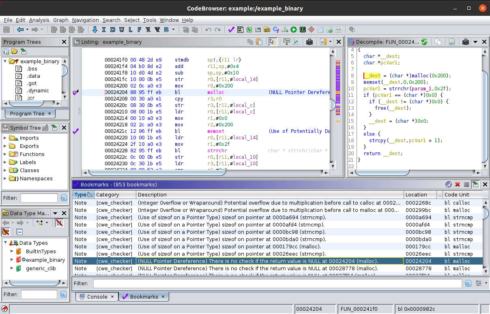

***Important note:*** We recently decided to migrate from Dockerhub to the Github container registry.
If you are using our prebuilt Docker images, please remember to change the cwe_checker-image names from `fkiecad/cwe_checker` to `ghcr.io/fkie-cad/cwe_checker` in your scripts!

<p align="center">
    
</p>

# cwe_checker #


[](https://fkie-cad.github.io/cwe_checker/index.html)

## What is cwe_checker? ##
cwe_checker is a suite of checks to detect common bug classes such as Null pointer dereferences and buffer overflows.
These bug classes are formally known as [Common Weakness Enumerations](https://cwe.mitre.org/) (CWEs).
The checks are based on a variety of anaylsis techniques ranging from simple heuristics to abstract interpretation-based data-flow analysis.
Its main goal is to aid analysts to quickly find potentially vulnerable code paths.

Its main focus are ELF binaries that are commonly found on Linux and Unix operating systems.
The cwe_checker uses [Ghidra](https://ghidra-sre.org/) to disassemble binaries into one common intermediate representation
and implements its own analyses on this IR.
Hence, the analyses can be run on most CPU architectures that Ghidra can disassemble,
which makes the *cwe_checker* a valuable tool for firmware analysis.

The following arguments should convince you to give *cwe_checker* a try:
-  it is very easy to set up, just build the Docker container!
-  it analyzes ELF binaries of several CPU architectures including x86, ARM, MIPS, and PPC
-  it is extensible due to its plugin-based architecture
-  it is configureable, e.g. apply analyses to new APIs
-  view results annotated in Ghidra
-  cwe_checker can be integrated as a plugin into [FACT](https://github.com/fkie-cad/FACT_core)

<p align="center">
    
</p>

## Installation ##

### Using the docker image ###

The simplest way is to pull the latest Docker image from the [Github container registry](https://github.com/fkie-cad/cwe_checker/pkgs/container/cwe_checker):
-   `docker pull ghcr.io/fkie-cad/cwe_checker:latest` yields an image based on the current master branch.
-   `docker pull ghcr.io/fkie-cad/cwe_checker:stable` yields an image based on the latest stable release version.
-   `docker pull ghcr.io/fkie-cad/cwe_checker:v0.6` yields an image based on the v0.6 stable release version.
However, it is recommended to switch to newer stable releases as soon as they get published, since improvements between stable versions can be quite significant.

If you want to build the docker image yourself, just run
```
docker build -t cwe_checker .
```
This way you can also build native Docker images for ARM-based PCs (e.g. newer Apple Macs).
The prebuilt Docker images are currently only x86-based.

### Local installation ###

The following dependencies must be installed in order to build and install the *cwe_checker* locally:
-   [Rust](https://www.rust-lang.org) >= 1.69
-   [Ghidra](https://ghidra-sre.org/) >= 10.2 (**Warning:** This applies to the master branch, the v0.6 stable release needs Ghidra 10.1.5)

Run `make all GHIDRA_PATH=/path/to/ghidra_folder` (with the correct path to the local Ghidra installation inserted) to compile and install the cwe_checker.
If you omit the `GHIDRA_PATH` argument the installer will search your file system for a local installation of Ghidra.

## Usage ##

The *cwe_checker* takes a binary as input,
runs several [checks](#checks) based on static analysis on the binary
and then outputs a list of CWE warnings that have been found during the analysis.

If you use the official docker image, just run
```bash
docker run --rm -v /PATH/TO/BINARY:/input ghcr.io/fkie-cad/cwe_checker /input
```
If you installed the *cwe_checker* locally, run
```bash
cwe_checker BINARY
```
You can adjust the behavior of most checks via a configuration file located at `src/config.json`.
If you modify it, add the command line flag `--config=src/config.json` to tell the *cwe_checker* to use the modified file.
For information about other available command line flags you can pass the `--help` flag to the *cwe_checker*.

If you use the stable version, you can also look at the [online documentation](https://fkie-cad.github.io/cwe_checker/index.html) for more information.

### For Bare-Metal Binaries ###

The cwe_checker offers experimental support for analyzing bare-metal binaries.
For that one needs to provide a bare metal configuration file via the `--bare-metal-config` command line option.
An example for such a configuration file can be found at `bare_metal/stm32f407vg.json`
(which was created and tested for an STM32F407VG MCU).

For more information take a look at the [online documentation](https://fkie-cad.github.io/cwe_checker/index.html).

## Documentation and Tests ##

The test binaries for our test suite can be built with `make compile_test_files` (needs Docker to be installed!). The test suite can then be run with `make test`.

Source code documentation can be built with `make documentation`. For the stable version, the documentation can be found [here](https://fkie-cad.github.io/cwe_checker/index.html).

## Implemented Checks <a name=checks></a> ##

So far the following analyses are implemented:
-   [CWE-78](https://cwe.mitre.org/data/definitions/78.html): OS Command Injection (currently disabled on standard runs)
-   [CWE-119](https://cwe.mitre.org/data/definitions/119.html) and its variants [CWE-125](https://cwe.mitre.org/data/definitions/125.html) and [CWE-787](https://cwe.mitre.org/data/definitions/787.html): Buffer Overflow
-   [CWE-134](https://cwe.mitre.org/data/definitions/134.html): Use of Externally-Controlled Format String
-   [CWE-190](https://cwe.mitre.org/data/definitions/190.html): Integer Overflow or Wraparound
-   [CWE-215](https://cwe.mitre.org/data/definitions/215.html): Information Exposure Through Debug Information
-   [CWE-243](https://cwe.mitre.org/data/definitions/243.html): Creation of chroot Jail Without Changing Working Directory
-   [CWE-332](https://cwe.mitre.org/data/definitions/332.html): Insufficient Entropy in PRNG
-   [CWE-367](https://cwe.mitre.org/data/definitions/367.html): Time-of-check Time-of-use (TOCTOU) Race Condition
-   [CWE-416](https://cwe.mitre.org/data/definitions/416.html): Use After Free and its variant [CWE-415](https://cwe.mitre.org/data/definitions/415.html): Double Free
-   [CWE-426](https://cwe.mitre.org/data/definitions/426.html): Untrusted Search Path
-   [CWE-467](https://cwe.mitre.org/data/definitions/467.html): Use of sizeof() on a Pointer Type
-   [CWE-476](https://cwe.mitre.org/data/definitions/476.html): NULL Pointer Dereference
-   [CWE-560](https://cwe.mitre.org/data/definitions/560.html): Use of umask() with chmod-style Argument
-   [CWE-676](https://cwe.mitre.org/data/definitions/676.html): Use of Potentially Dangerous Function
-   [CWE-782](https://cwe.mitre.org/data/definitions/782.html): Exposed IOCTL with Insufficient Access Control
-   [CWE-789](https://cwe.mitre.org/data/definitions/789.html): Memory Allocation with Excessive Size Value

Please note that both false positives and false negatives are to be expected due to shortcuts and the nature of static analysis as well as over-approximation.
You can find information on the inner workings of each check as well as known reasons for false positives and false negatives on the [check-specific documentation pages](https://fkie-cad.github.io/cwe_checker/doc/html/cwe_checker_lib/checkers/index.html).

## Integration into other tools ##

cwe_checker comes with a script for Ghidra,
which parses the output of the cwe_checker and annotates the found CWEs in the disassembler for easier manual analysis.
The script is located at `ghidra_plugin/cwe_checker_ghidra_plugin.py`, usage instructions are contained in the file.

<p align="center">
    
</p>

The cwe_checker is also integrated as a plugin in [FACT](https://github.com/fkie-cad/FACT_core).
If you want to integrate the cwe_checker into your own analysis toolchain, you can use the `--json` command line flag (in combination with either the `--quiet` or the `--out=...` command line options) to generate the CWE warnings in an easily parseable JSON output format.

## How does cwe_checker work internally? ##

Building the documentation using `cargo doc --open --document-private-items --no-deps` will give you more information about the internal structure of the cwe_checker.
However, the best documentation is still the source code itself.
If you have questions, be sure to ask them on our [discussions page](https://github.com/fkie-cad/cwe_checker/discussions)!
We are constantly striving to improve extensibility and documentation and your questions will help us to achieve that!

To get a quick/initial overview of its internals you can also look at the slides of conference presentations on the *cwe_checker* in the *doc* folder.
We presented cwe_checker at the following conferences so far:
-   [Pass The SALT 2019](https://2019.pass-the-salt.org/talks/74.html) ([slides](doc/slides/cwe_checker_pts19.pdf))
-   [Black Hat USA 2019](https://www.blackhat.com/us-19/arsenal/schedule/index.html#cwe_checker-hunting-binary-code-vulnerabilities-across-cpu-architectures-16782) ([slides](doc/slides/cwe_checker_BlackHatUSA2019.pdf))
-   [Black Hat USA 2022](https://www.blackhat.com/us-22/arsenal/schedule/#cwe_checker-architecture-independent-binary-vulnerability-analysis-26960) ([slides](doc/slides/cwe_checker_BlackHatUSA2022.pdf))

## Contribute ##

Contributions are always welcome. Just fork it and open a pull request!

## Acknowledgements ##

This project is partly financed by [German Federal Office for Information Security (BSI)](https://www.bsi.bund.de).

A special thanks goes out to the BAP community (especially the official gitter) for answering questions and discussing solutions.

## License ##
```
    Copyright (C) 2018 - 2023  Fraunhofer FKIE  (firmware-security@fkie.fraunhofer.de)

    This library is free software; you can redistribute it and/or
    modify it under the terms of the GNU Library General Public
    License as published by the Free Software Foundation; either
    version 3 of the License, or (at your option) any later version.

    This library is distributed in the hope that it will be useful,
    but WITHOUT ANY WARRANTY; without even the implied warranty of
    MERCHANTABILITY or FITNESS FOR A PARTICULAR PURPOSE.  See the GNU
    Library General Public License for more details.

    You should have received a copy of the GNU General Public License
    along with this program.  If not, see <http://www.gnu.org/licenses/>.
```
