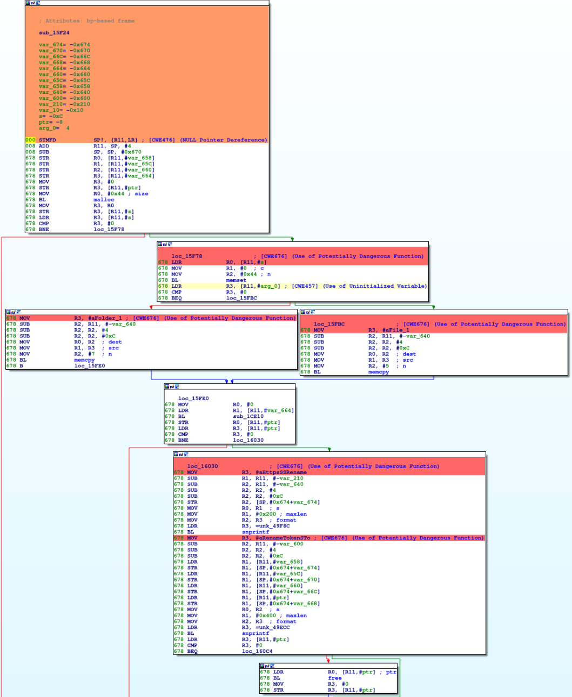

<p align="center">
    
</p>

# cwe_checker #
[](https://www.codacy.com/app/weidenba/cwe_checker?utm_source=github.com&amp;utm_medium=referral&amp;utm_content=fkie-cad/cwe_checker&amp;utm_campaign=Badge_Grade)
[](https://travis-ci.org/fkie-cad/cwe_checker)

## What is cwe_checker? ##
*cwe_checker* is a suite of tools to detect common bug classes such as use of dangerous functions and simple integer overflows. These bug classes are formally known as [Common Weakness Enumerations](https://cwe.mitre.org/) (CWEs). Its main goal is to aid analysts to quickly find vulnerable code paths.

Its main focus are ELF binaries that are commonly found on Linux and Unix operating systems. *cwe_checker* is built on top of [BAP](https://github.com/BinaryAnalysisPlatform/bap)(Binary Analysis Platform). By using BAP, we are not restricted to one low level instruction set architectures like Intel x86. BAP lifts several of them to one common intermediate representation (IR). cwe_checker implements its analyses on this IR. At time of writing, BAP 1.6 supports Intel x86/x64, ARM, MIPS, and PPC amongst others. Hence, this makes *cwe_checker* a valuable tool for firmware analysis.

*cwe_checker* implements a modular architecture that allows to add new analyses with ease. So far the following analyses are implemented across several BAP plugins:
-   [CWE-125](https://cwe.mitre.org/data/definitions/125.html): Out-of-bounds read (via emulation)
-   [CWE-190](https://cwe.mitre.org/data/definitions/190.html): Integer Overflow or Wraparound
-   [CWE-215](https://cwe.mitre.org/data/definitions/215.html): Information Exposure Through Debug Information
-   [CWE-243](https://cwe.mitre.org/data/definitions/243.html): Creation of chroot Jail Without Changing Working Directory
-   [CWE-248](https://cwe.mitre.org/data/definitions/248.html): Uncaught Exception
-   [CWE-332](https://cwe.mitre.org/data/definitions/332.html): Insufficient Entropy in PRNG
-   [CWE-367](https://cwe.mitre.org/data/definitions/367.html): Time-of-check Time-of-use (TOCTOU) Race Condition
-   [CWE-415](https://cwe.mitre.org/data/definitions/415.html): Double Free (via emulation)
-   [CWE-416](https://cwe.mitre.org/data/definitions/416.html): Use After Free (UAF) (via emulation)
-   [CWE-426](https://cwe.mitre.org/data/definitions/426.html): Untrusted Search Path
-   [CWE-457](https://cwe.mitre.org/data/definitions/457.html): Use of Uninitialized Variable
-   [CWE-467](https://cwe.mitre.org/data/definitions/467.html): Use of sizeof() on a Pointer Type
-   [CWE-476](https://cwe.mitre.org/data/definitions/476.html): NULL Pointer Dereference
-   [CWE-560](https://cwe.mitre.org/data/definitions/560.html): Use of umask() with chmod-style Argument
-   [CWE-676](https://cwe.mitre.org/data/definitions/676.html): Use of Potentially Dangerous Function
-   [CWE-782](https://cwe.mitre.org/data/definitions/782.html): Exposed IOCTL with Insufficient Access Control
-   [CWE-787](https://cwe.mitre.org/data/definitions/787.html): Out-of-bounds Write (via emulation)

Please note that some of the above analyses only are partially implemented at the moment. Furthermore, false positives are to be expected due to shortcuts and the nature of static analysis as well as over-approximation.

*cwe_checker* comes with a script called `cwe_checker_to_ida`, which parses the output of *cwe_checker* and generates a IDAPython script. This script annotates the found CWEs in IDA Pro, which helps during manual analysis of a binary. The colors represent the  severeness of the found issues (yellow, orange, or red). The following screenshot shows some results:

<p align="center">
    
</p>

## Why use cwe_checker? ##
The following arguments should convince you to give *cwe_checker* a try:
-  it is very easy to setup, just build the Docker container!
-  it analyzes ELF binaries of several CPU architectures including x86, ARM, MIPS, and PPC
-  it is extensible due to its plugin-based architecture
-  it is configureable, e.g. apply analyses to new APIs
-  view results annotated in IDA Pro
-  *cwe_checker* can be integrated as a plugin into [FACT](https://github.com/fkie-cad/FACT_core)
## How to install cwe_checker? ##
There are several ways to install cwe_checker. The recommended way is to get cwe_checker from the Ocaml package manager Opam. You can install cwe_checker via the package [cwe_checker](https://opam.ocaml.org/packages/cwe_checker/) (`opam install cwe_checker`). This gives you a stable version of cwe_checker.

Another option is to pull the latest Docker container from [dockerhub](https://hub.docker.com/r/fkiecad/cwe_checker) (`docker pull fkiecad/cwe_checker`).

If you plan to develop cwe_checker, it is recommended to build it using the provided `Makefile`. In this case you must ensure that all dependencies are fulfilled:
-   Ocaml 4.05.0
-   Opam 2.0.2
-   dune >= 1.6
-   BAP 1.6 (and its dependencies)
-   yojson >= 1.6.0
-   alcotest >= 0.8.3 (for tests)
-   Sark (latest) for IDA Pro annotations
-   pytest >= 3.5.1 (for tests)
-   SCons >= 3.0.5 (for tests)
-   odoc >= 1.4 (for documentation)

Just run `make all` to compile and register the plugin with BAP. You can run the test suite via `make test`. Documentation can be built via `dune build @doc`.
## How to use cwe_checker? ##
The usage is straight forward: adjust the `config.json` (if needed) and call BAP with *cwe_checker* as a pass.
``` bash
bap PATH_TO_BINARY --pass=cwe-checker --cwe-checker-config=src/config.json
```
The emulation checks can be run with the emulation recipe in the recipes folder.
``` bash
bap PATH_TO_BINARY --recipe=recipes/emulation
```
For other common use cases you can find some recipes in the recipes folder. These can be run with
``` bash
bap PATH_TO_BINARY --recipe=recipes/RECIPE_FOLDER_NAME
```
*cwe_checker* outputs to stdout. This output is parsable (sexep). There is a script `cwe_checker_to_ida` to visualize the results in IDA Pro.
## How to extend cwe_checker? ##
New plugins should be added to src/checkers. Implement a .ml and .mli file. See the existing modules for an interface description. If necessary add a section to `config.json` to allow users to configure your plugin. Finally, add your plugin to `plugins/cwe_checker/cwe_checker.ml`.

If you plan to open a PR, please utilize [precommit](https://pre-commit.com) in your development environment to catch many issues before the code review.
### Contribute ###
Contributions are always welcome. Just fork it and open a pull request!
## How does cwe_checker work internally? ##
Documentation can be built via `dune build @doc` which builds the documentation in the directory *_build/default/_doc/_html*. But the most accurate documentation is still the source code. At the moment, we also provide documentation in *doc/*. This includes documentation of how to solve certain tasks with cwe_checker (e.g. implement your own plugin) and also the slides conference presentations on cwe_checker. The slides about cwe_checker should be of special interest for those who would like to get a quick/initial overview of its internals. 

We presented cwe_checker at the following conferences so far:
- [Pass The SALT 2019](https://2019.pass-the-salt.org/talks/74.html) ([slides](doc/slides/cwe_checker_pts19.pdf))
- [Black Hat USA 2019](https://www.blackhat.com/us-19/arsenal/schedule/index.html#cwe_checker-hunting-binary-code-vulnerabilities-across-cpu-architectures-16782)

## Acknowledgements ##
This project is partly financed by [German Federal Office for Information Security (BSI)](https://www.bsi.bund.de).

A special thanks goes out to the BAP community (especially the official gitter) for answering questions and discussing solutions.
## License
```
    Copyright (C) 2018 -       Fraunhofer FKIE  (firmware-security@fkie.fraunhofer.de)

    This library is free software; you can redistribute it and/or
    modify it under the terms of the GNU Library General Public
    License as published by the Free Software Foundation; either
    version 3 of the License, or (at your option) any later version.

    This library is distributed in the hope that it will be useful,
    but WITHOUT ANY WARRANTY; without even the implied warranty of
    MERCHANTABILITY or FITNESS FOR A PARTICULAR PURPOSE.  See the GNU
    Library General Public License for more details.

    You should have received a copy of the GNU General Public License
    along with this program.  If not, see <http://www.gnu.org/licenses/>.
```
